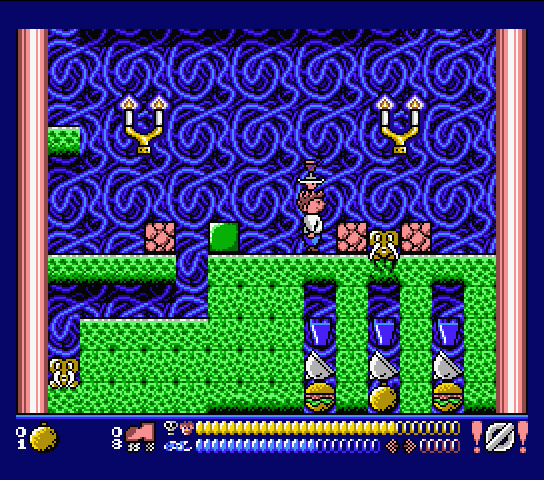

# Frantic (MSX-2 game, made in 1992)

The [Z80](https://en.wikipedia.org/wiki/Zilog_Z80) (8-bit microprocessor) source code is provided here, as it was written in 1992 by André Ligthart from the [MSX](https://en.wikipedia.org/wiki/MSX) group [ANMA](https://www.msx.org/wiki/ANMA), with only the following modifications:
* the source code is now compatible with the [Z80 Glass cross-assembler](http://www.grauw.nl/projects/glass/) (written in Java). 
* [`replayer.asm`](../../blob/main/src/replayer.asm) (music/sound effect replayer) has been commented extensively.

Because only comments and assembler directives (like `DB`) have changed, the resulting binaries are identical to the original binaries ([with a few exceptions](../../blob/main/src/MODIFICATIONS.md)).

You can see the game in action on [this YouTube longplay](https://www.youtube.com/playlist?list=PLHp4wuWd8InM9cQMos87vhI9aHSGlkAhy). If you have build the game, you might need [this cheats](https://www.cheatmsx.com/en/cheats/461/anma-1992-frantic.html), because the game is not easy to play.
You also might want to read [how to play](./_extra/how_to_play.md) this game.



## Usage


### Step 1 - prepare your system

You need the [Java Runtime Environment](https://www.java.com/download/), because the Z80-assembler `glass-0.5.jar` depends on it. 
[Git](https://git-scm.com/downloads) is preferred (but optional) to get the files. For example, with popular Linux distributions, you can prepare your system like this:
```
sudo apt update
sudo apt install openjdk-8-jre
sudo apt install git
```

### Step 2 - download the files

If you have `git` installed:
```
git clone https://github.com/stompetower/frantic
```
If you don't have `git` installed: download the `.zip` file of this repository (about 35MB) and unpack.

### Step 3 - run the make script

Linux:
```
cd frantic
chmod u+x make
./make
```

Windows:
```
cd frantic
make
```

A `dsk` directory will be created with all the game files (for MSX or emulator).


## Running the game

This game can run within a MSX emulator or on a real MSX-2 (or higher). Insert the (virtual) floppy disk and type:
```
BLOAD"FRANTIC.LOD",R
```

### Running within an emulator

For example, you can use the [openMSX emulator](https://openmsx.org/). This emulator can use a directory with files as if it were a floppy disk (DirAsDisk). This way, you can run the game straight from the generated files in the `dsk` directory.

Instead you can also create a `frantic.dsk` file (a 720kB virtual floppy disk file). In that case, you need a tool like [Disk-Manager](http://www.lexlechz.at/en/software/DiskMgr.html).

### Running on a real MSX-2

You need a real MSX-2 (or higher) with a 720kB floppy disk drive. The MSX computer must have at least a 64kB RAM (memory mapper) and 128kB VRAM (which every common MSX-2 or higher will have).

You also need to copy the generated files to a physical 720kB (3.5 inch) floppy disk. This can be done with a tool like [Disk-Manager](http://www.lexlechz.at/en/software/DiskMgr.html), but you need to have a 3.5 inch floppy disk drive connected to your PC (internal or USB) in order to copy the files.


## Optional `AUTOEXEC.BAS`

Instead of running the game by `BLOAD"FRANTIC.LOD",R`, you can create an `AUTOEXEC.BAS` that will load the game after the MSX (or emulator) is booted (with the game disk inserted).
It will also check if your MSX-2 (or emulator) meets the minimum RAM/VRAM requirements, just like the `AUTOEXEC.BAS` of the original game.
Type this using the MSX (or emulator) with the (virtual) game disk inserted:
```
10 ` FRANTIC v1 - (c)1992 ANMA
20 `
30 SCREEN 0:KEY OFF
40 IF (PEEK(&HFAFC)AND4)=0 THEN 80
50 PRINT"Loading FRANTIC... "
60 BLOAD"FRANTIC.LOD",R
70 CLS:PRINT"No 64 kB memory mapper.":END
80 PRINT"No 128 kB VRAM.":END

SAVE"AUTOEXEC.BAS"
```

## Modify / improve this game

This repository allows you to modify the Z80 logic in any way you like. Changing other content (Jobs, Music, Graphics) is also possible, but is somewhat less straightforward.

### Modify logic / Z80 code

Just change any `.asm` file in the [`src`](../../tree/main/src) directory and run the `make` script again.

### Modify Job content

See more info in the [`jobs`](../../tree/main/jobs) directory.
Also look in this directory in case you want to create a modern job / stage editor for Frantic.

### Modify music

See more info in the [`mus`](../../tree/main/mus) directory.

### Modify graphics

See more info in the [`gfx`](../../tree/main/gfx) directory.

## Game files

The final files that make up the game:

Filename | Type | Comment
-------- | ---- | -------
`FRANTIC.LOD` | Z80 logic | loads other files
`FRANTIC1.BIN` | Z80 logic | intro and story
`FRANTIC2.BIN` | Z80 logic | main game
`FRANTIC3.BIN` | Z80 logic | game ending
`FRANTIC.REP` | Z80 logic | replayer music/sound effects
`FRANTIC1.JOB` | content | Job 1
`FRANTIC2.JOB` | content | Job 2
`FRANTIC3.JOB` | content | Job 3
`FRANTIC4.JOB` | content | Job 4
`FRANTIC5.JOB` | content | Job 5
`FRANTIC6.JOB` | content | Job 6
`FRANTIC1.GRP` | graphics | intro and story (+ intro sprites)
`FRANTIC2.GRP` | graphics | intro and story
`FRANTIC3.GRP` | graphics | general game graphics (+ sprites)
`FRANTIC4.GRP` | graphics | Job 1
`FRANTIC5.GRP` | graphics | Job 2
`FRANTIC6.GRP` | graphics | Job 3
`FRANTIC7.GRP` | graphics | Job 4
`FRANTIC8.GRP` | graphics | Job 5
`FRANTIC9.GRP` | graphics | Job 6
`FRANTICA.GRP` | graphics | ending
`FRANTIC1.MUS` | music | talking Cramp, continue, job finished
`FRANTIC2.MUS` | music | intro / story
`FRANTIC3.MUS` | music | ending
`FRANTIC4.MUS` | music | Job 1
`FRANTIC5.MUS` | music | Job 1
`FRANTIC6.MUS` | music | Job 2
`FRANTIC7.MUS` | music | Job 2
`FRANTIC8.MUS` | music | Job 3
`FRANTIC9.MUS` | music | Job 3
`FRANTICA.MUS` | music | Job 4
`FRANTICB.MUS` | music | Job 4
`FRANTICC.MUS` | music | Job 5
`FRANTICD.MUS` | music | Job 5
`FRANTICE.MUS` | music | Job 6

The game has 6 Jobs (=stages). Each Job has its own graphics and also two songs, except for Job 6 which has one song.

## License

Mozilla Public License 2.0, see [LICENSE](LICENSE).

## Credits

[Thom Zwagers](https://github.com/thomzwg) did most of the work for this repository, like reverse-engineering lost source code. He also made the source code suitable for the Glass cross-assembler. 
André Ligthart did the documentation and the comments in the `replayer.asm` file. [ANMA](https://www.msx.org/wiki/ANMA) (André Ligthart and Martijn Maatjens) made the original game.
Grauw / [Laurens Holst](http://www.grauw.nl/about/) made the [Glass cross-assembler](http://www.grauw.nl/projects/glass/) used to build the Z80 logic.

## History

This game was originally developed in 1992 on a real MSX-2 (mainly the [Sony HB-F700P](https://www.msx.org/wiki/Sony_HB-F700P)). The assembler used was GEN80.COM (version 2.04, HiSoft 1987).
The text editor used was TED (version 2.6 by M.J. Vriend). The graphics editor used was Halos (from Sony).
The music tracker used was [ANMA's RED](https://www.msx.org/news/software/en/anmas-red-music-recordereditor-available-for-download),
which can be [downloaded here](https://www.msx.org/downloads/anmas-red-music-recordereditor-incuding-music-etc).
See more about history in the [`_extra`](../../tree/main/_extra) directory.


## Also info you might not expect...

Besides the source code (and the necessary game binaries), this repository includes much more you might not expect:

- All jobs / stages extracted as [`.png` images](../../tree/main/_extra/_jobs_as_png_maps).
- The [map_maker](../../tree/main/_extra/_jobs_as_png_maps/_map_maker) (C# code) that created these images.
- The map (tiles) part of all [Jobs in `.asm` format](../../tree/main/jobs/_maps_in_asm) (alternative to the [binary format](../../tree/main/jobs)).
- [History documents](../../tree/main/_extra/_history) about Frantic.
- [The tools](../../tree/main/_extra/_history_tools) and [the hardware](../../blob/main/_extra/_history_tools/USED_HARDWARE.md) ANMA used in 1992.
- A [manual](../../tree/main/mus/_tracker_RED) of the used music tracker RED with a [list of all effects](../../blob/main/mus/_tracker_RED/RED_EFFECTS.md).
- The [custom build hardware](../../tree/main/mus/_tracker_RED_custom_hardware) that was used together with the music tracker.
- All [music in `.AMU` format](../../tree/main/mus/_tracker_files) that can be edited with the music tracker RED.
- All music in [readable `.TXT` format](../../tree/main/mus/_tracker_files_txt).
- Info about [sprites](../../tree/main/gfx/_sprites) and [where in VRAM](../../tree/main/gfx/_vram_pages_in_png) the graphics are loaded.


