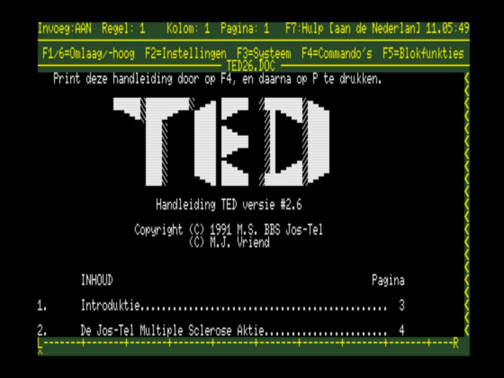
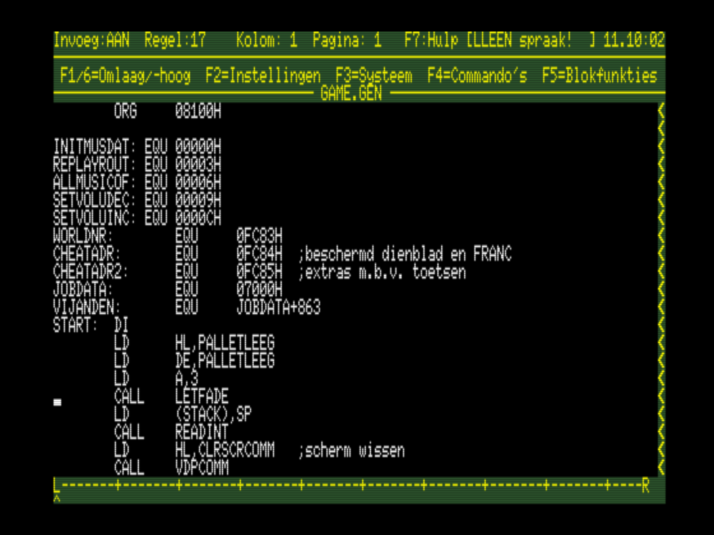
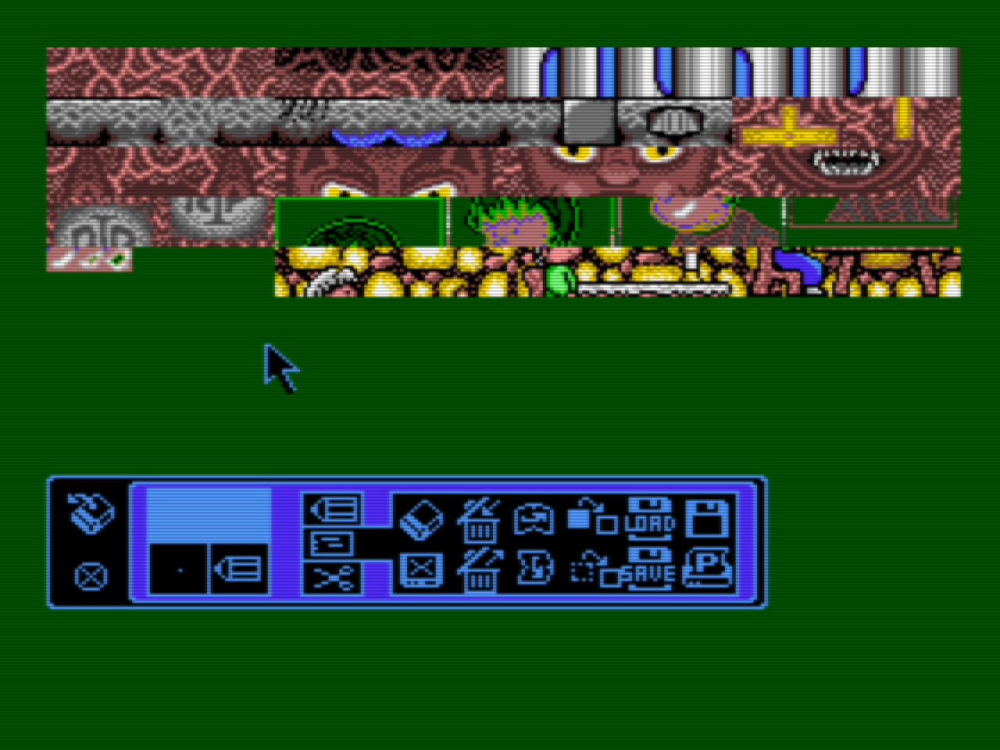
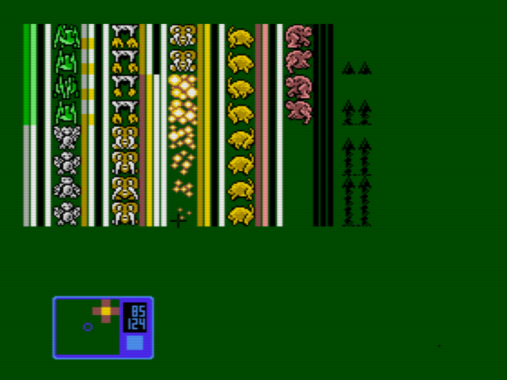
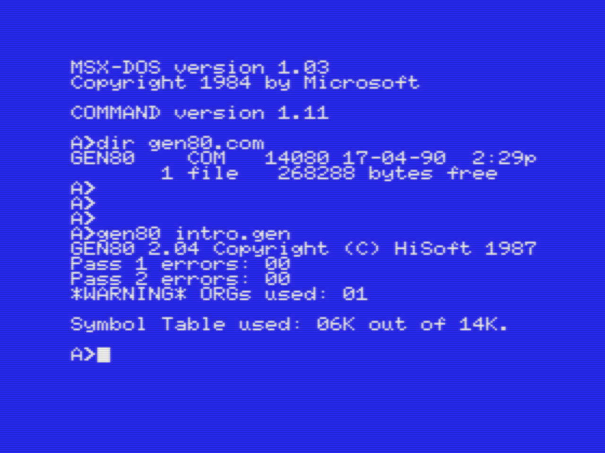
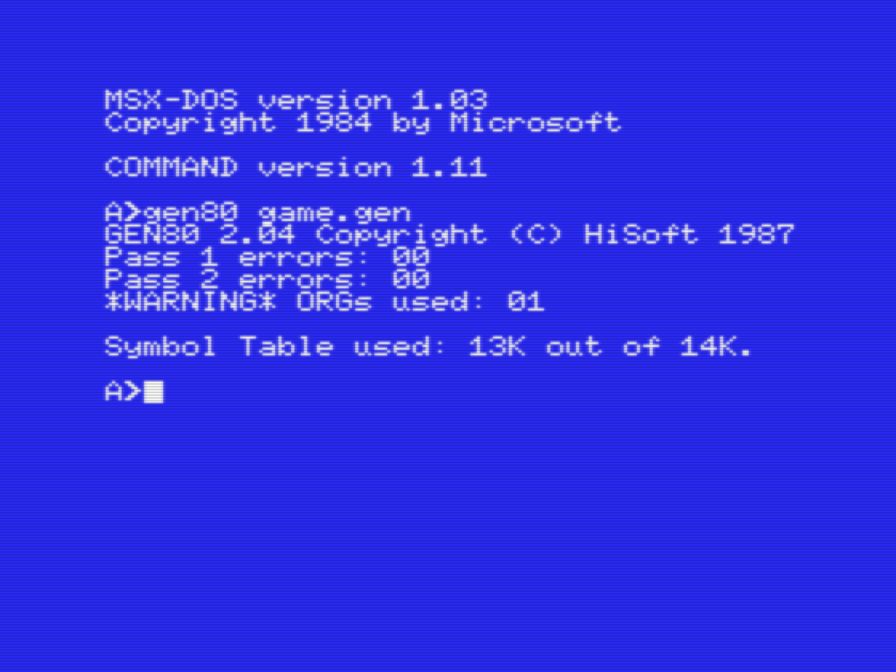
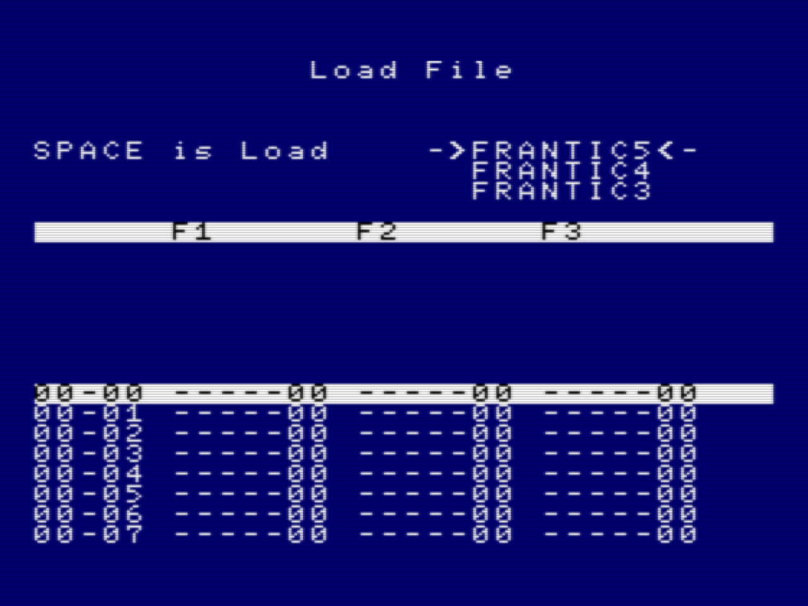
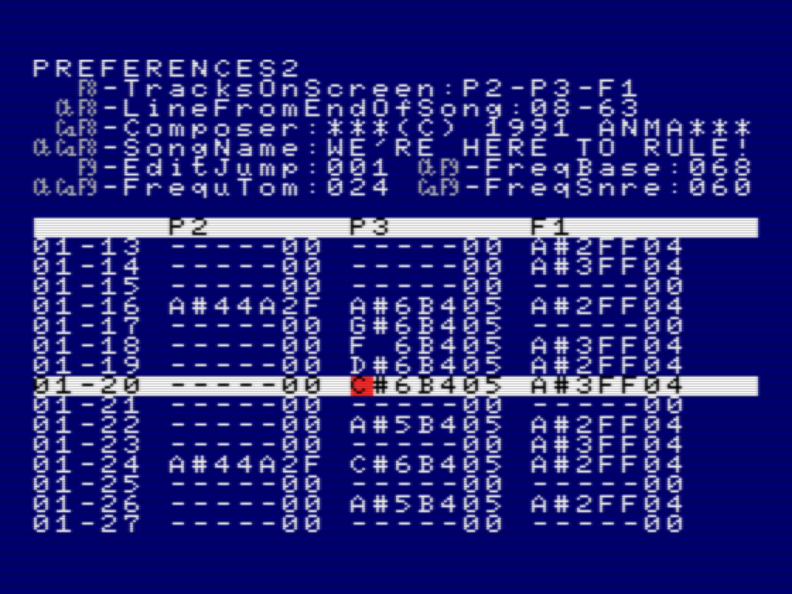
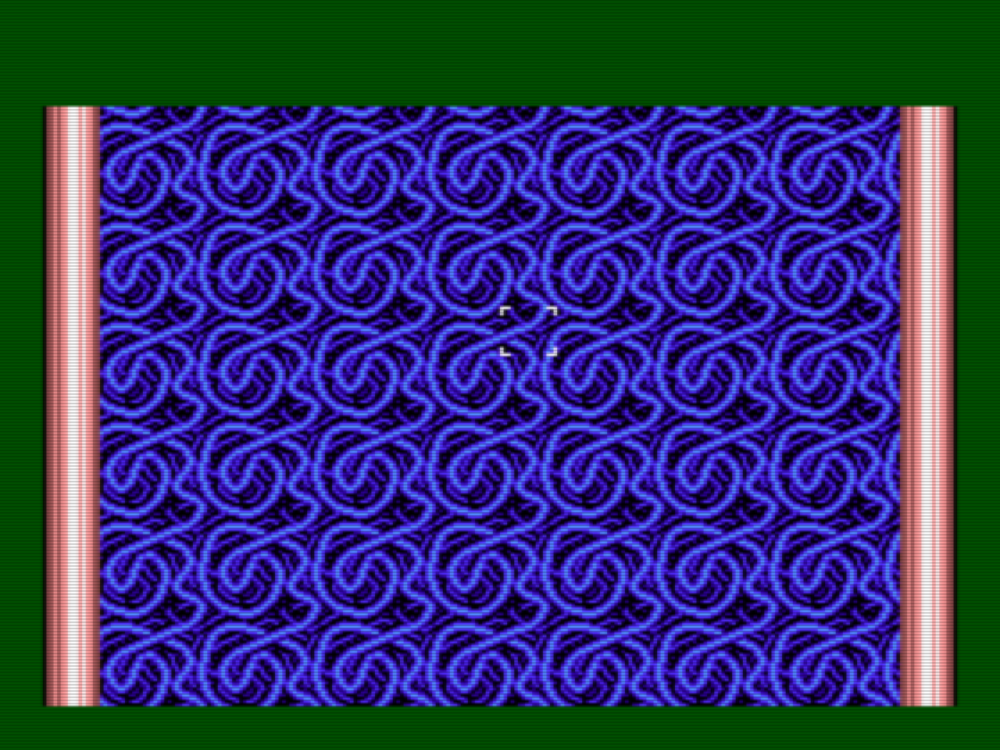
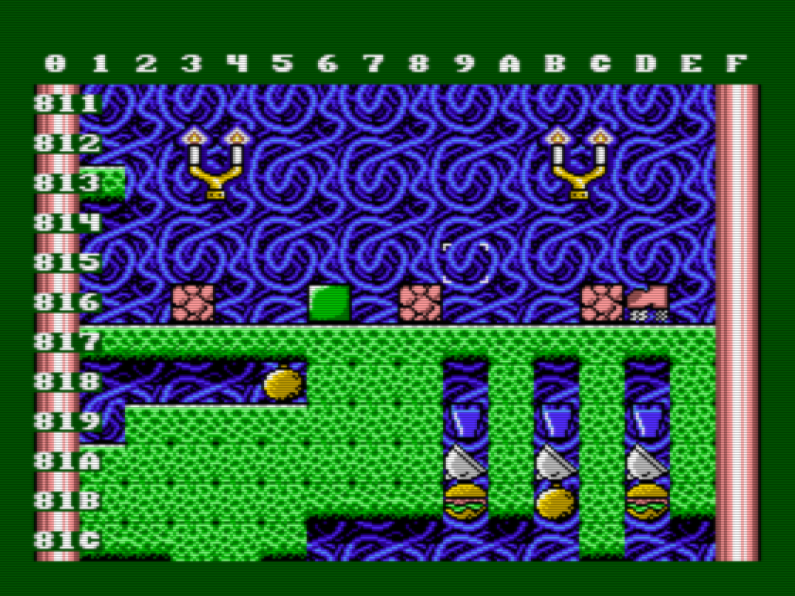

# Tools used in 1992 (all MSX)

## Text editor for source code

TED (version 2.6), by M.J. Vriend.

## Graphics editor

Halos by Sony.

## Z80 Assembler

GEN80.COM (version 2.04), HiSoft 1987

## Music tracker

RED (music Recorder/EDitor), by ANMA 1991.

## Job / content editor

FReditor, by ANMA 1992.

