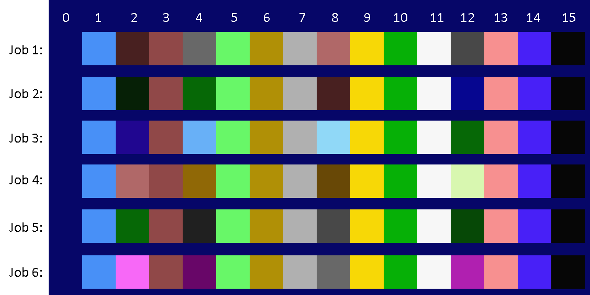

# Sprites

The original sprite designs are in the `_designs` subdirectory.
To see the final sprite patterns, see the `_final_patterns` subdirectory.
To see where the sprites are stored within the graphics, see the `_gfx/_vram_pages_in_png` directory.

The tools to convert the sprite designs to the right format for MSX (sprite pattern table, sprite color table), may be lost.

## Sprite colors

Most sprites in Frantic make use of a VDP feature to get 3 colors 
(possible on each horizontal line) when using 2 sprites. The third (bonus) color appears where the 2 sprites have overlapping pixels. That color number is the logical 'OR' of the other 2 colors.

To get this feature, bit 6 in the sprite color table has to be set true
for one of the two sprites that represents the character or enemy.

In Frantic, these sprites (during game play) use this 3-color feature:
- Franc and his tray
- all enemies
- hovering platforms
- explosion

Some examples of 3-color combinations used in the game:

color1 | color2 | color1 OR color2 | comment
-------- | ---- | ------- | -------
1 | 14 | 15 | light blue, blue, black
3 | 13 | 15 | brown, pink, black
5 | 10 | 15 | light green, green, black
7 | 11 | 15 | grey, white, black
6 | 9 | 15 | dark yellow, yellow, black
3 | 9 | 11 | brown, yellow, white
6 | 11 | 15 | dark yellow, white, black
3 | 14 | 15 | brown, dark blue, black

Below (see also `palettes.png`) the color palette for each stage/job is shown.
You can see that only the colors 2, 4, 8 and 12 vary per job/stage of the game.
None of these colors (that will change with each job) are used in sprite graphics.

These (more simple) sprites do not use the 3-color feature:
- skewers
- bullets
- spit
- water drop

## Sprite Attribute Table (during game play)

Sprite attributes (Y, X, pattern, color) are kept in RAM and copied to VRAM every interrupt.
See code-file `subs.asm`, label `SPRITEATR` (32 x 4 bytes of data are defined here). 

The maximum of 32 sprites are used as follows:

Sprite index: | Usage:
-------- | ----
0 | spit
1,2 | the tray
3,4,5,6 | Franc himself 
7,8,9 | water drops (3x), max 3 drops on the screen
10,11 | bullets (2x), max 2 bullets on the screen
12,13 | skewer (1)
14,15 | skewer (2)
16,17 | enemy (1)
18,19 | enemy (2)
20,21 | enemy (3)
22,23 | enemy (4)
24,25 | enemy (5)
26,27 | red block/rock during movement
28,29 | moving/hovering platform (1)
30,31 | moving/hovering platform (2)

Note that there are max 2 skewers, 5 enemies and 2 moving/hovering platforms on the screen simultaneously.

## Sprite Pattern Table (during game play)

The Sprite Pattern table can hold 64 patterns of 16x16 pixels, of which 32 can be displayed at once (see Attribute table above).
However, there are 256 patterns (48 + 80 + 128) needed in Frantic during game play, as you can see in the directory `gfx/_sprites/_final_patterns`.

The strategy used to overcome this problem is to dynamically copy sprite pattern data to the Sprite Pattern table in VRAM for the the player Franc, the enemies and the hovering platforms.

The first 48 sprite patterns are always available in the first 3/4th of the Sprite Pattern table: skewers, bullet, spit, water drop, moving rock and all variations of the tray.

The remaining 16 sprite patterns are dynamically copied from another VRAM location to the last 1/4th of the Sprite Pattern table in VRAM.
Which sprites patterns are copied depends on which enemies are visible at that time. 
It also depends on which frame of each sprite animation is to be shown. So the remaining 16 sprite patterns are used as follows:

What | How many patterns | Info
---- | ----------------- | ------
player Franc | 4 | current frame of player (looking left / right, walking / jumping / falling / bending down)
enemies | 10 | current frame of each of the 5 enemies (2 patterns per enemy)
hovering platforms | 2 | current frame of the hovering platforms

## Location of sprite data in VRAM (during game play)

Which sprite data | VRAM location | VRAM location in hex | Info
----------------- | ------------- | -------------------- | ----
Sprite Color table | page 1, lines 232-235 | F400 - F5FF | 16 bytes of color info for each of 32 sprites
Sprite Attribute table | page 1, line 236 | F600 - F67F | 4 bytes for each of 32 sprites
Sprite Pattern table| page 1, lines 240-255 | F800 - FFFF  | 32 bytes for each of the 64 sprite patterns (16x16 pixels)

