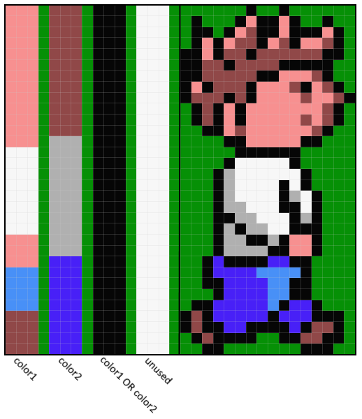

# Sprite designs

In this directory you can see how the game sprites were designed. Most sprites make use of a VDP feature to get 3 colors.

As you can see above, there are 3 vertical bars that define which colors are allowed on each specific line:
- `color1` for the first sprite pattern (example: color `11` = white).
- `color2` for the second sprite pattern (example: color `7` = grey).
- `color1 OR color2` for the overlapping pixels (example: `11 OR 7` = `15` = black).

The original designs are available in [this download](https://www.msx.org/downloads/anmas-frantic-sources). Look for the virtual disk `'Frantic - Graphics2.dsk'`.

The `MSX-BASIC` tools that convert these designs to 'sprite pattern data' and 'sprite color data' are probably lost.

To see how the final sprite patterns look (without color information), look at the `../_final_patterns` directory.

All sprites are included in the game files `FRANTIC1.GRP` (intro sprites) and `FRANTIC3.GRP` (game sprites). The information in the `gfx/_vram_pages_in_png` directory explains exactly where the 'sprite pattern data' and 'sprite color data' is in VRAM.

