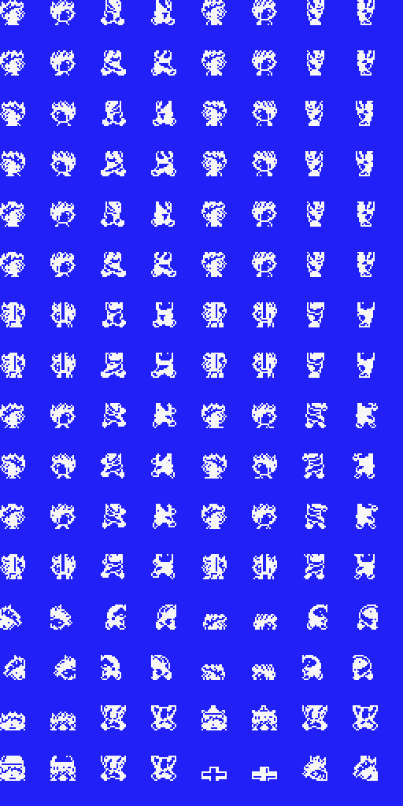

# Sprite patterns

In this directory you can see how the sprite patterns look without color information.

For example, there are 128 sprites of the player Franc (32 positions of 4 sprites each) as you can see in the image below. 

All sprites are included in the game files `FRANTIC1.GRP` (intro sprites) and `FRANTIC3.GRP` (game sprites). The information in the `gfx/_vram_pages_in_png` directory explains exactly where the 'sprite pattern data' and 'sprite color data' is in VRAM. For example, the Franc sprites are in VRAM on page 1 from line 112 to line 143.

