# Overview of graphics in VRAM

## During intro & story

#### VRAM page 1

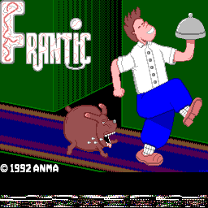 

#### VRAM page 2

Same graphics with different color palettes:

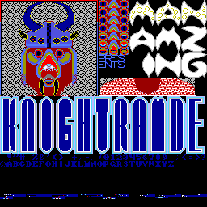 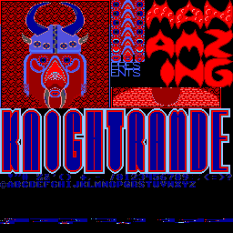 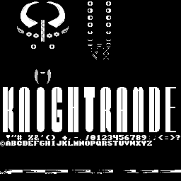  
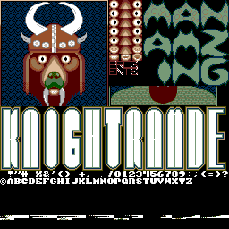 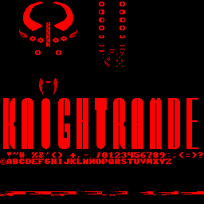

#### VRAM page 3

Same graphics with different color palettes:

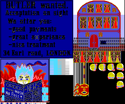 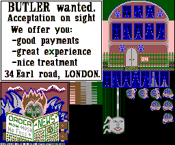  
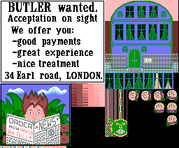 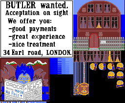

## During gameplay

#### VRAM page 1

Depending on which of the 6 jobs is loaded:

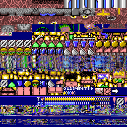 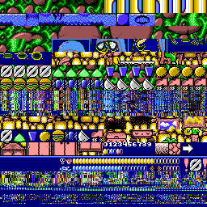 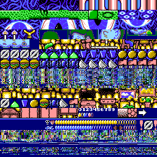  
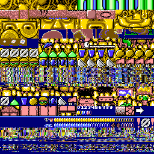 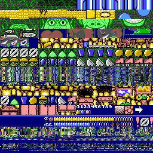 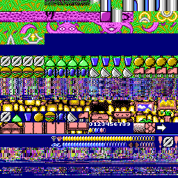

#### VRAM page 2

Same graphics with different color palettes:

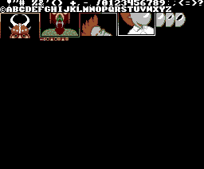 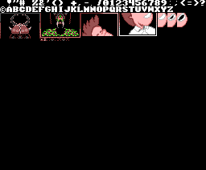

## Ending

#### VRAM page 1

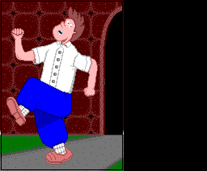

#### VRAM page 2

Same graphics with different color palettes:

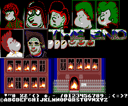 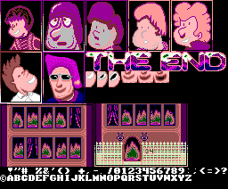 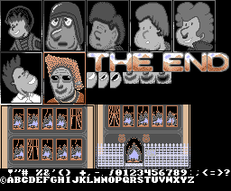

