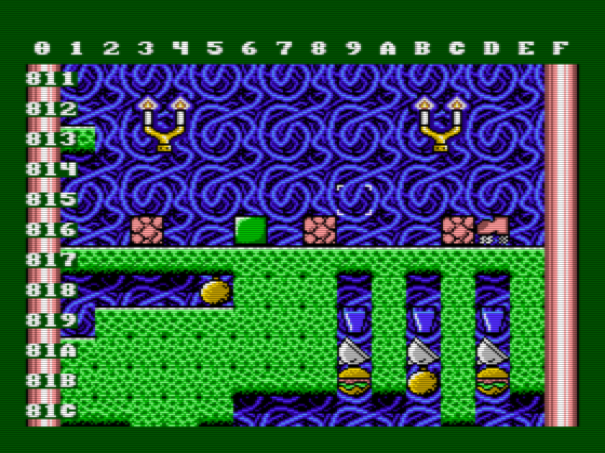

# Frantic Job content (`.JOB` files)

Each `.JOB` file is made up of two separate parts, which are simply concatenated:
- `MAP?.BIN` which contains all background tiles and can be edited with FREditor, a custom made editor.
- `stage?.asm` which should be assembled and then concatenated to the `MAP?.BIN`

Instead of using FREditor, the tiles can also be edited in text (this is more awkward). Look at the `map?.asm` files in the [`_extra`](../../../tree/main/jobs/_extra) subdirectory.
It gives insight in the simple structure of these tile maps.

See the subdirectory [`_freditor`](../../../tree/main/jobs/_freditor) for more info about FREditor and how to edit tile maps.
The tool itself is in the `_freditor` subdirectory of this repository. It's also available as part of [this download](https://www.msx.org/downloads/anmas-frantic-sources).
You need a real MSX-2 (or emulator).

To see what content is in the `.JOB` file, look at the `.png` images [here](../../../tree/main/_extra/_jobs_as_png_maps).
These big maps have been generated from the `.JOB` files by a piece of `C#` code which you can [check here](../../../tree/main/_extra/_jobs_as_png_maps/_map_maker). 
This `FranticMapMaker` can also be of help with analyzing the structure of a `.JOB` file.

In the sections below is more detailed information about the structure of a `.JOB` file.

## Binary layout of `.JOB` file

The 'map' part of the `.JOB` file just consists of a 7-byte BLOAD-header and a big matrix of 16 x 768 bytes.
Each byte represents a tile of 16 x 16 pixels: backgrounds, platforms, items, etc. These tiles can be edited with the FREditor tool.

The BLOAD-header is only used by the FREditor tool to load the file using `MSX-BASIC`. It is ignored by by the `loader.asm` of the game.
The end-address in the BLOAD header do not need to be changed after the other part (assembled `stage?.asm`) is concatenated to get the final `.JOB` file.

The data represented by `stage?.asm` starts at offset `03007H` (after 16 x 768 + 7 bytes).
This data is about textual conversations, color palettes, moving enemies and more.

The tables below shows the complete layout of the `.JOB` file. The first 2 columns are in hex notation.


offset in .JOB file | memory location in game | length in bytes | meaning
------------------- | ----------------------- | --------------- | ---------
**`0000-0006`**  |  **`n.a.     `**      |    **7**    |   **BLOAD-header (ignored by FRantic loader)**
**`0007-0016`**  |  **`4000-400f`**      |    **16**    |  **1st row**
**`0017-0026`**  |  **`4010-401f`**      |    **16**    |  **2nd row**
**`0027-0036`**  |  **`4020-402f`**      |    **16**    |  **3rd row**
**`....-....`**  |  **`....-....`**      |    **...**    | **... [764 more rows here]**
**`2ff7-3006`**  |  **`6ff0-6fff`**      |    **16**    |  **768th row**
`3007-3026`  |  `7000-701f`      |    32      |   color palette in game
`3027-3046`  |  `7020-703f`      |    32      |   color palette heads Franc and guest (talking)
`3047-3056`  |  `7040-704f`      |    16      |   music (0 or 1) at left elevator doors (0-15)
`3057-3066`  |  `7050-705f`      |    16      |   music (0 or 1) at right elevator doors (0-15)
`3067     `  |  `7060     `      |    1       |   music (0 or 1) to start with
`3068     `  |  `7061     `      |    1       |   number of Job
`3069-306a`  |  `7062-7063`      |    2       |   address where Franc will start (eg: 04043H)
`306b-3076`  |  `7064-706f`      |    12      |   data about talking guest (mouth animation)
`3077-3176`  |  `7070-716f`      |    256     |   text of Earl Cramp (at start of Job)
`3177-3356`  |  `7170-734f`      |    480     |   text of guest conversation (end of Job)
`3357-3365`  |  `7350-735e`      |    15      |   dummy leading enemies, just for technical reasons
`3366-????`  |  `735f-????`      |    (5 x e) |   enemies and moving platforms, 5 bytes each (e = number of enemies)
last 5 bytes | last 5 bytes  |     5      |   final dummy enemy: 000H,0C0H,0ECH,0,0

In the table above, everything **bold** represents data from `MAP?.BIN`, the rest is data from `stage?.asm`.
 
See further down this document for more details about enemy data structure.
 
## Workflow to build `.JOB` file
 
Suppose you want to change Job 3, then follow this workflow:
- Start FReditor. Use the MSX disk `'freditor.dsk'` in the `_freditor` subdirectory of this repository. It's also available as part of [this download](https://www.msx.org/downloads/anmas-frantic-sources).
- Ensure that the design to edit is on the same MSX disk (in this case: `MAP3.BIN`).
- Choose `3` when asked for stage number. This results in Job 3 graphics being loaded for editing.
- Type `[ESC]` followed by `L` to load a file. All files on the current disk will be shown in text mode.
- Now enter `MAP3.BIN` followed by `[RETURN]`. This will load the design of Job 3.
- You can now edit the design of this job by changing tiles (backgrounds, platforms, etc). See the `_freditor` subdirectory of this repository for info and keyboard shortcuts.
- Use `[SELECT]` to show the memory address of each tile location. Write down the addresses where you want moving enemies, like spiders, birds, etc. Also where you want moving platforms (start location / end location) and where you want the player Franc to start.
- Type `[ESC]` followed by `S` to save the changed file. This file does only contain the map of all 16 x 768 tiles.
- Copy `MAP3.BIN` from the virtual MSX Disk to this directory, for example use a tool like [Disk-Manager](http://www.lexlechz.at/en/software/DiskMgr.html).


*Above: FREditor with addresses shown after `[SELECT]` key pressed. For example, the 2 bombs are at `08185H` and `081BBH`.*

Now edit `stage3.asm`. Here you can edit:
 - Color palettes of Job 3 graphics.
 - Which music to start, and which to start at each elevator door.
 - Start position of Franc. [*]
 - X/Y position data of mouth animation (the guest you see after finishing the Job).
 - Text of earl Cramp you see before you start.
 - Conversation you see after finishing the job.
 - List of enemy data (5 bytes each). [*]
 - Closing bytes.
 
[*] Focus on these if you only change the Job without changing graphics and texts.

See further below for more details about the data structure for enemies. Note that all data have fixed lengths (even the conversational texts), except for the final list with enemy data. So keep the filling spaces where texts are defined.

Now you have changed both `MAP3.BIN` and `stage3.asm` in this directory, you only have to run the `make` script of this repository.
If you don't want to rebuild all each time, you can simply make your own script:
- Assemble `stage3.asm` to `STAGE3.BIN` with the Glass assembler.
- Concatenate the 2 parts (like: `copy MAP3.BIN/B + STAGE3.BIN/B FRANTIC3.JOB`).

Now you have `FRANTIC3.JOB` which can be used with the original game.
It contains the all backgrounds (with platforms) as well as meta-data, moving enemies and moving platforms.
 

## Moving enemies in `stage?.asm`
 
The moving enemies (like bird, spider, etc.) and the hovering platforms are the most difficult parts of a `.JOB` file to edit. You can find it at the bottom of each `stage?.asm` file. It is the last data structure in a `.JOB` file. Each enemy or hovering platform is defined with 5 bytes of data.

All location addresses are `04000H` lower than shown in FReditor. 
For example, when you see address `8052` in FReditor (use `[SELECT]` key), you need to edit:
`DW 04052H` (or:  `DB 052H,040H` ).
Such location addresses are used for Franc's start position and within the list of enemies/moving platforms.

#### Each enemy is described with 5 bytes:

- low-byte of location address
- high-byte of location address
- unique `ID` of enemy
- enemy type (1, 2, 3, 4, 5, 6 or 7)
- extra data (only used with enemy type 1, 6, 7: bird or moving platform)

#### List of enemy types:

- 1 = bird
- 2 = yellow rat
- 3 = kangaroo
- 4 = spider
- 5 = yellow digger
- 6 = moving platform1 (not an enemy, never mind...)
- 7 = moving platform2 (not an enemy, never mind...)

For example, the first 2 enemies of Job 3 (see `stage3.asm`) are two 'yellow diggers':
```
DEFB  064H,041H,1,5,0 ; enemy 5 = yellow digger with ID=1 at location 04164H (in FReditor: 8164)
DEFB  06AH,041H,2,5,0 ; enemy 5 = yellow digger with ID=2 at location 0416AH (in FReditor: 816A)
```
The 5th byte (extra data) is only used for birds and moving platforms. 

#### The 'extra data' for birds

For birds, the 5th byte describes the second low-byte, so that the bird can fly a horizontal line.
For example, the first bird of Job 3 is as follows:
```
DEFB 04DH,042H,3,1,042H ; bird flies between 0424DH and 04242H (in FReditor: 824D-8242)
```

#### The 'extra data' for hovering platforms

For hovering platforms, the 5th byte describes:

- amount of tiles to move (maximum: 63)
- whether platform moves vertically (add 64 if true)
- whether platform moves up OR left from start position (add 128 if true)

#### Example: horizontal hovering platform

```
DEFB 0E2H,04CH,16,6,8 ; platform starts at 04CE2H (in FReditor: 8CE2) and moves 8 tiles to the right.
```

#### Example: vertical hovering platform

```
DEFB  0ACH,046H,11,7,36+64     ; starts at 046ACH, moves vertical (+64), moves 36 tiles DOWN from here
DEFB  074H,047H,12,2,0         ; an enemy between begin and end of vertical hovering platform
DEFB  0C5H,047H,13,3,0         ; an enemy between begin and end of vertical hovering platform
DEFB  0ECH,048H,11,7,36+128+64 ; starts at 048ECH, moves vertical (+64), moves 36 tiles UP (+128) from here
```
Notes:
- The platforms at `046ACH` and `048ECH` are ONE AND THE SAME!! For technical reasons, 
only VERTICALLY moving platforms need to be described twice (address top position and address bottom position). Also note that the `ID` is the same (is this example: `11`), so it's ONE moving platform!
- The top and bottom positions (here `046ACH` and `048ECH`) are related like this:
`top_address + (16 * amount_of_moving) = bottom_address`.  Example: `046ACH + (16 * 36) = 048ECH`.
- No more than 2 moving platforms can be visible at one time. When 2 moving platforms need to be
visible at one time, ensure to use enemy type `6` and `7` (not `6` and `6`, also not `7` and `7`). So there can only by one type `6` and one type `7` (both hovering platforms) be visible at the same time. For other enemies (birds, spiders, etc) this constraint does not apply.


#### Finally

The list of enemies/platforms must always be ordered by the location address. 
See the example above:  `046ACH` -> `04774H` -> `047C5H` -> `048ECH` ( = ordered from low to high).
This is to assure that the right enemies/platforms appear while Franc moves up/down through the Job.

The last 5 bytes in `stage?.asm` (`000H,0C0H,236,0,0`) are needed to prevent 'random' enemies at the bottom of the Job.


