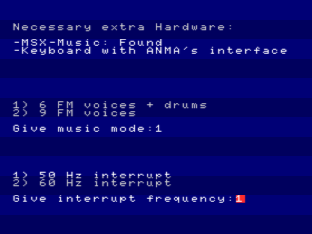
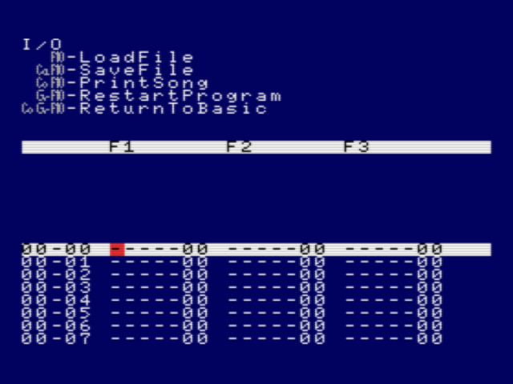
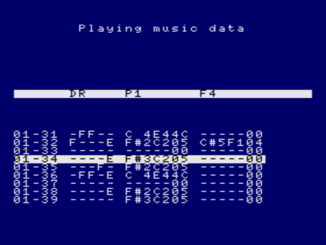
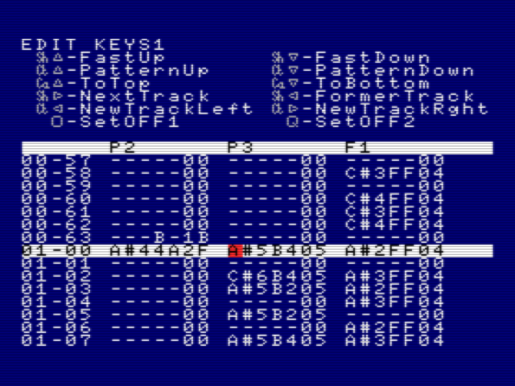
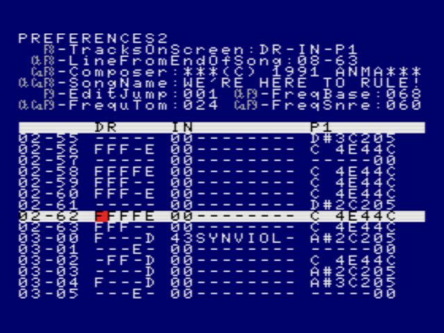
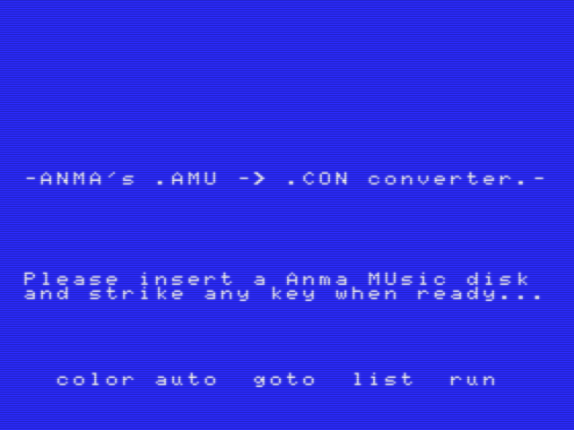

# Music tracker RED - short manual


ANMA's RED is a music tracker that was used to create music for ANMA products for the MSX system.
Sound chip support:
- The standard MSX PSG soundchip (AY-3-8910).
- Yamaha YM2413 (OPLL) FM-chip (= MSX-MUSIC).

Optional support for music keyboard:
- Philips music keyboard [NMS-1160](https://www.msx.org/wiki/Philips_NMS_1160), together with custom build [ANMA hardware](https://www.msx.org/wiki/ANMA_Keyboard_Interface). 
- Live recording while the tracker is running (eg. with a already made basslines and drums).
- Faster entering of notes in edit mode.

Requirements to run RED:
- MSX-2 or higher (real or emulator) with at least 256 kB RAM.
- MSX-MUSIC (not needed for music that only uses PSG channels)




## Starting up RED


- Hold `[CTRL]` down during startup of the computer, with the RED disk inside the floppy drive. 
- Press `[1]` for RED v1 or press `[2]` for RED v2 (v1 and v2 differ only in some effects and custom instruments).
- press `[ENTER]` when RED has been started with a dark-blue background.
- Choose `'6 FM voices + drums'` and also the interrupt frequency (50 or 60 Hz).
- You can also choose the `'9 FM voices'` mode, but this mode is rarely used.
- An empty composition is now being initialized.
- Any time you see a red colored border, it means the tracker is busy processing.
- After startup, the RED disk is not needed anymore (the complete software remains in memory).


## Music files
- A music file made with RED has the `.AMU` file extension.
- A `.AMU` file has always a size of 110848 bytes, regardless of the size of the composed song.
- A `.AMU` can be converted to a much more compressed `.CON` file (=CONverted) with a Converter tool.
- A `.CON` file can be used in products, but is typically renamed to a `.MUS` file.
- Thus a `.MUS` file of a ANMA product is in fact a renamed `.CON` file.
- `.AMU` files that were made with RED v1 should also later be loaded/edited with the same RED v1.
- `.AMU` files that were made with RED v2 should also later be loaded/edited with the same RED v2.
- There are little differences between RED v1 and v2 (only some effects and custom instruments).
- Made with RED v1: music for No Fuss, Nosh, The Source of Power demo, Anti-rip demo.
- Made with RED v2: music for Frantic, TROXX, RELAX demo, No Fuss promo 2
- Made with another tracker: Squeek demo 1 and 2, DYNANMA demo
- Made without a tracker: Squeek

## Basic features and principles

- A pattern is a 64-row part of a song  (`00-00` -> `00-63`, `01-00` -> `01-63`, etc.).
- There is a maximum of 32 patterns than can be edited (pattern `00` - pattern `31`)
- So there are maximum 32 * 64 = 2048 rows. Row `31-63` is the last row.
- A Track = a channel = a voice.
- The tracks `P1`, `P2` and `P3` represent the 3 channels of the PSG chip.
- The tracks `F1`, `F2`, `F3`, `F4`, `F5`, `F6` are the 6 channels of the OPLL-chip (MSX-MUSIC).
- The tracks `F7`, `F8` and `F9` are available when `'9 FM voices'` mode has been chosen at startup.
- The track `DR` represents the 5 OPLL drums (base / snare / tom / hi hat / cymbal).
- The track `IN` is used to set the OPLL custom instrument (=instrument '0' for tracks `F1` - `F9`).
  - The OPLL FM-chip supports only 1 custom instrument; instruments 1 - 15 are fixed instruments.
  - There are 193 custom instruments (in hex: `01` - `C1`), mainly extracted from the FM-PAC ROM.
  - Each instrument is defined by 8 bytes (see `User Tone Registers` of the OPLL chip).

## Keyboard Controls


Use `[SELECT]` to see all the capabilities and keyboard shortcuts on the upper part of the screen. For example, the screenshot below shows the I/O features with the keyboard shortcuts in grey.



These abbreviations are used for the keyboard shortcuts:

```
Sh = [SHIFT]
Ct = [CTRL]
Se = [SELECT]
Ca = [CAPS]
Es = [ESC]
Tb = [TAB]
Gr = [GRAPH]
Co = [CODE]
Ho = [HOME]
De = [DEL]
F6  = [SHIFT]+[F1]
F7  = [SHIFT]+[F2]
F8  = [SHIFT]+[F3]
F9  = [SHIFT]+[F4]
F10 = [SHIFT]+[F5]
```

Some example keyboard shortcuts:

- Use `[SELECT]` to walk through all 7 help views (ascending).
- Use `[SHIFT]+[SELECT]` to walk through all 7 help views (descending).
- Use `[SHIFT]+[F5]` to load a song.
- Use `[F1]` to play the current pattern (like `00-00` - `00-63`) with auto repeat.
- Use `[ESC]` or `[SPACE]` to stop playing music.
- Use `[CTRL]+[F1]` to play the complete song.
- Use `[CTRL]+[LEFT]` / `[CTRL]+[RIGHT]` to change the visible tracks.
- Use `[SHIFT]+[LEFT]` / `[SHIFT]+[RIGHT]` to navigate through the 3 visible tracks.
- Use `[CAPS]+[F1]` to play only the track where the cursor resides.
- Use `[CTRL]+[UP]` / `[CTRL]+[DOWN]` to go to the former / next pattern.
- Use `[F6]` to specify which tracks should be on or off.
- Use `[CTRL]+[SELECT]` to navigate to a specific row.




## Entering notes

First decide which tracks must be visible:
- Use `[CTRL]+[LEFT]` or `[CTRL]+[RIGHT]` to quickly change the visible tracks.
- Or use `[F8]` to select 3 specific tracks (`TracksOnScreen` feature).

Position the red cursor where a note should be entered:
- See the help view named `'EDIT KEYS1'` for some keyboard shortcuts for editing.
- Optionally, use `[F9]` (`EditJump` feature) to skip extra rows after each input.

If you have the Philips music keyboard NMS-1160 connected:
- Just push the key on the music keyboard. The note will appear at the cursor's position.
- Use `[CTRL]+[F2]` (`FirstOctaveOnKeyboard` feature) to change which octaves are used.

If you do **not** have the Philips music keyboard:
- Enter the letter of the note (`A` - `G`).
- Optionally enter the sharp sign (`#`).
- Enter the octave number (`1` - `8`).


For example, the result might be `C#4--03` :
- The `03` is the effect (`03` does nothing more than playing the note)
- The `--` means that there is no extra data needed for this effect.

You can use `[HOME]` to enter the last added note again.

For editing, some defaults can be set:
- Use `[F3]` to set the default volume per track during editing
- Use `[F4]` to set the default instrument per track during editing
- Use `[F5]` to set the default effect per track during editing

See below for more info about effects.




## Song level settings
- Use `[CTRL]+[CAPS]+[F8]` to set the name of the song.
- Use `[CAPS]+[F8]` to set the composer.
- Use `[TAB]` to set the speed at which the song should be played.
  - Speed `003` is a common speed setting, while speed `000` is the most fast speed.
  - Use effect `30` to change the speed during (midway) a song.
- Use `[CTRL]+[F8]` to set the last row of the song.
- Use `[CAPS]+[F2]` to set whether the song should repeat after finishing.
- Use `[CTRL]+[CAPS]+[F2]` to set the row at which the song should repeat.
- Use `[CTRL]+[TAB]` to set the volume and FM instruments that should be applied to all channels.
  - This is only done at song initialization, and can be changed by effects at any time.
  - For example, `A6` means volume 10 (=hex `A`) and instrument `6`.

## Drums (OPLL)



- See track `DR`
- Each row has 5 characters which represent the following OPLL drums (left to right):
  - Base drum
  - Snare drum
  - Tom
  - Hi hat
  - Cymbal
- A drum that will play has its volume set between 1 and 15 (`1` - `F` in hex notation)
- A `-` means that the specific drum will not play on that specific row.
- A few examples:
  - `FE---` means: base drum on volume 15, snare drum on volume 14.
  - `A---9` means: base drum on volume 10, cymbal on volume 9.
- The pitch of some drums can be set as follows (this is a feature of the OPLL chip):
  - Use `[CTRL]+[F9]` to set the base drum pitch.
  - Use `[CAPS]+[F9]` to set the snare drum pitch.
  - Use `[CTRL]+[CAPS]+[F9]` to set tom drum pitch.
- There are also drums for the PSG channels; this is done with specific effects.

## Block Commands

- Use `[SELECT]` until you see the help view `'BLOCK COMMANDS'`.
- Here you some of the possibilities, like:
  - Increase volume of notes in a single track.
  - Change an effect within track.
  - Copy data on track level.
  - Copy all tracks (for example, duplicate a pattern).
  - Etc.
- Important to know: for most block commands a begin- and end marker have to be set first.
  - Use `[CTRL]+[B]` to set the Begin Marker.
  - Use `[CTRL]+[E]` to set the End Marker.
- For copy block commands, the position of the cursor is also used.

## Some more about editing

- Use `[SELECT]` until you see the help view `'EDIT KEYS2'`.
- Use `[DEL]` to delete a note.
- Use `[CTRL]+[DEL]` to clear the current pattern (=64 rows).
- Use `[SHIFT]+[DEL]` to clear only 1 track of the current pattern.
- Use `[CAPS]+[DEL]` to remove a pattern (patterns below will be moved up).
- Use `[INS]` to insert a new pattern (patterns below will be moved down).


## Info about effects


- ANMA's RED has many effects, like pitch slides, vibrations, PSG drums, arpeggio effects and many more.
- [This list of all effects](RED_EFFECTS.md) describe all possible effects within RED.
- The effects are implemented by the [replayer code](https://github.com/stompetower/frantic/blob/main/src/replayer.asm). For example, start looking at the labels `PSGEFFECTS` and `FMPEFFECTS`.
- Effect `00` does nothing and means 'no input'. This is shown as `-----00`.
- A dash sign (`-`) means that there is no data needed on that position.

Some examples:
- `C#3--03` : effect 03, play note C#3 (without changing volume or instrument).
- `E 3D404` : effect 04, play note E3 with volume 13 (=`D`), instrument 4.
- `C#2F004` : effect 04, play note C#2 with volume 15 (=`F`), instrument 0 (set by track `IN`).
- `---F30B` : effect 0B, set volume to 15 (=`F`) and slide 3 pitch units up each interrupt.
- `---9-1B` : effect 1B, change volume to 9 (of a note already playing).
- `-----4D` : effect 4D, play an imitated PSG snare drum (only to be used on track `P1`).
- `---F-48` : effect 48, play an imitated PSG base drums with volume 15 (=`F`).
- `----406` : effect 06, decrease volume after each 4 interrupts (volume fade down).

So there is always the same pattern like `NNNXYEE` :
- Where `EE` is the effect number in hex notation.
- Where `NNN` is the note to be played if applicable for the effect (eg.: `C#4`).
- Where `XY` represents extra data in hex notation (eg.: `F8`).
  - the `X` often represents the volume, but it can be any data.
  - the `Y` can be any data, like the instrument or a counter.

The effects `01` and `02` do not follow the pattern above:
- `OFF1-01` : effect 01, turn off the note that is now playing.
- `OFF2-02` : effect 02, same, but turn it off less abruptly (feature of OPLL chip).


## Converting `.AMU` to `.MUS`


The `.AMU` file format can only be used within the music tracker RED. To use the song within a product, it has to be converted/compressed. The converter tool is on the `CONVERTER.dsk` virtual disk and is part of [this download](https://www.msx.org/downloads/anmas-red-music-recordereditor-incuding-music-etc).



The converter tool creates a smaller file with a `.CON` extension. Such file is typically renamed to `.MUS` when used in products.
