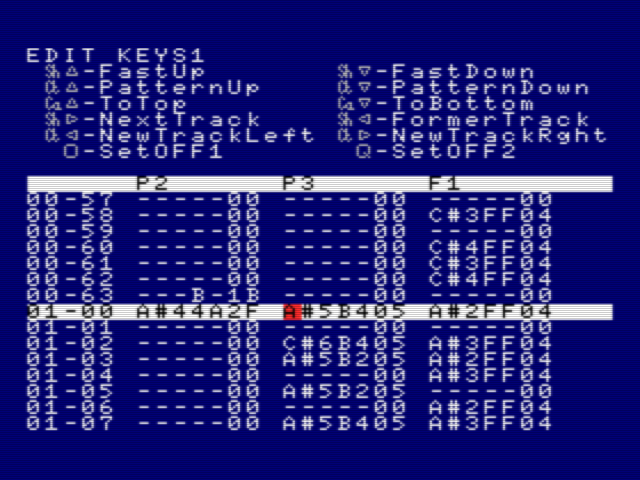

# List of effects (tracker RED)

In RED, everything on the PSG tracks (`P1`/`P2`/`P3`) and FM tracks (`F1`/`F2`/`F3`/`F4`/`F5`/`F6`/`F7`/`F8`/`F9`) is done with effects. For example, in the screenshot below the effects `04`, `05`, `1B` and `2F` (all hex notation) are used:

The tables below describe all possible effects.
- The first column is the effect number in decimal notation. This number is used in the source code of the replayer (`src/replayer.asm`). For example, if you want to see the implementation of effect number 27, look at the labels `EFFPSG27` (for PSG implementation) and `EFFFM27` (for FM/OPLL implementation).
- The second column is the effect number in hex notation. The tracker RED uses hex notation, see the above screenshot.
- The third column describes on which positions data is needed for a PSG track. There are always 7 character positions and the last 2 represent the effect number (like `04`). A dash sign (`-`) indicates that no data is needed on that position. `NNN` means that a music note is needed there (like `C#4`). `V` means that a value for volume is needed there (`0` to `F` in hex). When you see `X` or `Y`, it means that other data is needed (`0` to `F` in hex). This other data can be anything (like counter, instrument, interrupts, noise frequency).
- The fourth column describes on which positions data is needed for a FM track. In most cases it's the same as for the PSG track, but it may be different, like effect `04`. Some effects are PSG-only, like PSG drum effects.
- The fifth column gives a short description and what extra data (like `Y`) means.

## The complete list of effects

dec | hex | PSG track | FM track | Description
--- | --- | ----------- | ---------- | -----------
1  | `01` | `OFF1-01` | `OFF1-01` | turn off this channel abruptly
2  | `02` | `OFF2-02` | `OFF2-02` | turn off this channel quickly, but not abruptly

#### Standard effects, very often used
dec | hex | PSG track | FM track | Description
--- | --- | ----------- | ---------- | -----------
3  | `03` | `NNN--03` | `NNN--03` | play a note (same volume as last note)
4  | `04` | `NNNV-04` | `NNNVY04` | play a note with volume V. On FM channel: also set instrument to Y
5  | `05` | `NNNVY05` | `NNNVY05` | play note with volume V, decrease volume every Y interrupts

#### miscellaneous effects
dec | hex | PSG track | FM track | Description
--- | --- | ----------- | ---------- | -----------
6  | `06` | `----Y06` | `----Y06` | fade out volume: decrease volume every Y interrupts
7  | `07` | `NNNVY07` | `NNNVY07` | play note, turn off volume after Y interrupts, then on after Y interrupts, repeat
8  | `08` | `NNNVY08` | `NNNVY08` | play note, turn off volume after Y interrupts
9  | `09` | `-----09` | `-----09` | stop current effect

#### Pitch/frequency slide effects
dec | hex | PSG track | FM track | Description
--- | --- | ----------- | ---------- | -----------
10 | `0A` | `NNNVY0A` | `NNNVY0A` | play note, slide pitch UP by Y every interrupt (also set volume)
11 | `0B` | `---VY0B` | `---VY0B` | slide pitch UP by Y every interrupt (also set volume)
12 | `0C` | `NNNVY0C` | `NNNVY0C` | play note, slide pitch UP by (Y+16) every interrupt (also set volume)
13 | `0D` | `---VY0D` | `---VY0D` | slide pitch UP by (Y+16) every interrupt (also set volume)
14 | `0E` | `NNNVY0E` | `NNNVY0E` | play note, slide pitch UP by 1 every Y interrupts (also set volume)
15 | `0F` | `---VY0F` | `---VY0F` | slide pitch UP by 1 every Y interrupts (also set volume)
16 | `10` | `NNNVY10` | `NNNVY10` | play note, slide pitch DOWN by Y every interrupt (also set volume)
17 | `11` | `---VY11` | `---VY11` | slide pitch DOWN by Y every interrupt (also set volume)
18 | `12` | `NNNVY12` | `NNNVY12` | play note, slide pitch DOWN by (Y+16) every interrupt (also set volume)
19 | `13` | `---VY13` | `---VY13` | slide pitch DOWN by (Y+16) every interrupt (also set volume)
20 | `14` | `NNNVY14` | `NNNVY14` | play note, slide pitch DOWN by 1 every Y interrupts (also set volume)
21 | `15` | `---VY15` | `---VY15` | slide pitch DOWN by 1 every Y interrupts (also set volume)
22 | `16` | `---VY16` | `---VY16` | just once, slide pitch UP by Y (also set volume)
23 | `17` | `---VY17` | `---VY17` | just once, slide pitch UP by (Y+16) (also set volume)
24 | `18` | `---VY18` | `---VY18` | just once, slide pitch DOWN by Y (also set volume)
25 | `19` | `---VY19` | `---VY19` | just once, slide pitch DOWN by (Y+16) (also set volume)

#### miscellaneous effects
dec | hex | PSG track | FM track | Description
--- | --- | ----------- | ---------- | -----------
26 | `1A` | `NNNV-1A` | `NNNV-1A` | set OPLL pitch/volume without starting new note with KEY bit (for PSG: same as effect 4)
27 | `1B` | `---V-1B` | `---V-1B` | only change volume

#### pitch/frequency vibration effects
dec | hex | PSG track | FM track | Description
--- | --- | ----------- | ---------- | -----------
28 | `1C` | `NNNVY1C` | `NNNVY1C` | play note, vibrate every Y interrupts with pitch offset 2 (also set volume)
29 | `1D` | `---VY1D` | `---VY1D` | vibrate every Y interrupts with pitch offset 2 (also set volume)
30 | `1E` | `NNNVY1E` | `NNNVY1E` | play note, vibrate every Y interrupts with pitch offset 5 (also set volume)
31 | `1F` | `---VY1F` | `---VY1F` | vibrate every Y interrupts with pitch offset 5 (also set volume)
32 | `20` | `NNNVY20` | `NNNVY20` | play note, vibrate every Y interrupts with pitch offset 12 (also set volume)
33 | `21` | `---VY21` | `---VY21` | vibrate every Y interrupts with pitch offset 12 (also set volume)
34 | `22` | `NNNVY22` | `NNNVY22` | play note, vibrate every Y interrupts with pitch offset 20 (also set volume)
35 | `23` | `---VY23` | `---VY23` | vibrate every Y interrupts with pitch offset 20 (also set volume)

#### pitch/frequency waving effects
dec | hex | PSG track | FM track | Description
--- | --- | ----------- | ---------- | -----------
36 | `24` | `NNNVY24` | `NNNVY24` | play note, slide down 1 during x interrupts, then up, repeat (also set volume)
37 | `25` | `---VY25` | `---VY25` | slide down 1 during x interrupts, then up, repeat (also set volume)
38 | `26` | `NNNVY26` | `NNNVY26` | play note, slide down 2 during x interrupts, then up, repeat (also set volume)
39 | `27` | `---VY27` | `---VY27` | slide down 2 during x interrupts, then up, repeat (also set volume)
40 | `28` | `NNNVY28` | `NNNVY28` | play note, slide down 4 during x interrupts, then up, repeat (also set volume)
41 | `29` | `---VY29` | `---VY29` | slide down 4 during x interrupts, then up, repeat (also set volume)
42 | `2A` | `NNNVY2A` | `NNNVY2A` | play note, slide down 1 every 1 in 2 interrupts for x times, then up, repeat (also set volume)
43 | `2B` | `---VY2B` | `---VY2B` | slide down 1 every 1 in 2 interrupts for x times, then up, repeat (also set volume)

#### Arpeggio effects (fast alternating real note pitches)
dec | hex | PSG track | FM track | Description
--- | --- | ----------- | ---------- | -----------
44 | `2C` | `NNNXY2C` | `NNNXY2C` | arpeggio without repeating (notes that alternate can be controlled with XY)
45 | `2D` | `NNNXY2D` | `NNNXY2D` | arpeggio (keeps repeating) (notes that alternate can be controlled with XY)
46 | `2E` | `NNNXY2E` | `NNNXY2E` | arpeggio (keeps repeating), also decrease volume (notes that alternate can be controlled with XY)
47 | `2F` | `NNNXY2F` | `NNNXY2F` | arpeggio (keeps repeating), also decrease volume slowly (notes that alternate can be controlled with XY)

#### Change song speed
dec | hex | PSG track | FM track | Description
--- | --- | ----------- | ---------- | -----------
48 | `30` | `---XY30` | `---XY30` | set speed of song (to change speed while playing song). Speed XY in hex format.

#### Volume waving effects
dec | hex | PSG track | FM track | Description
--- | --- | ----------- | ---------- | -----------
49 | `31` | `NNNVY31` | n.a. | play note, decrease volume with 1 for x interrupts, then increase, repeat
50 | `32` | `---VY32` | n.a. | decrease volume with 1 for x interrupts, then increase, repeat
51 | `33` | `NNNVY33` | n.a. | play note, decrease volume with 1 every 1 in 2 interrupts (x times), then increase, repeat
52 | `34` | `---VY34` | n.a. | decrease volume with 1 every 1 in 2 interrupts (x times), then increase, repeat
53 | `35` | `NNNVY35` | n.a. | play note, decrease volume with 1 every 1 in 4 interrupts (x times), then increase, repeat
54 | `36` | `---VY36` | n.a. | decrease volume with 1 every 1 in 4 interrupts (x times), then increase, repeat

#### Volume increase effects
dec | hex | PSG track | FM track | Description
--- | --- | ----------- | ---------- | -----------
55 | `37` | `NNNVY37` | `NNNVY37` | play note with volume V, increase volume every Y interrupts
56 | `38` | `----Y38` | `----Y38` | only increase volume every Y interrupts

#### Volume decrease and vibrate effects
dec | hex | PSG track | FM track | Description
--- | --- | ----------- | ---------- | -----------
57 | `39` | `NNNVY39` | `NNNVY39` | decrease volume with 3 after Y interrupts, then increase with 2 after Y interrupts, repeat
58 | `3A` | `NNNVY3A` | `NNNVY3A` | decrease volume with 4 after Y interrupts, then increase with 2 after y interrupts, repeat
59 | `3B` | `NNNVY3B` | `NNNVY3B` | decrease volume with 6 after Y interrupts, then increase with 3 after Y interrupts, repeat

#### Out-of-pitch effect
dec | hex | PSG track | FM track | Description
--- | --- | ----------- | ---------- | -----------
60 | `3C` | `NNNVY3C` | `NNNVY3C` | play note with small pitch deviation Y (to create richer synth-like sounds), also set volume

#### unused effects
dec | hex | PSG track | FM track | Description
--- | --- | ----------- | ---------- | -----------
61 | `3D` | n.a. | n.a. | (unused, do nothing)
62 | `3E` | n.a. | n.a. | (unused, do nothing)
63 | `3F` | n.a. | n.a. | (unused, do nothing)

#### Special PSG effects (mostly drums)
dec | hex | PSG track | FM track | Description
--- | --- | ----------- | ---------- | -----------
64 | `40` | n.a. | `---XY40` | 
64 | `40` | `---VY40` | n.a. | PSG drum with noise pitch Y (PSG1 only!) - bring volume down very quick
65 | `41` | `---VY41` | n.a. | PSG drum with noise pitch Y (PSG1 only!) - ...less quick
66 | `42` | `---VY42` | n.a. | PSG drum with noise pitch Y (PSG1 only!) - ...not very quick
67 | `43` | `---VY43` | n.a. | PSG drum with noise pitch Y (PSG1 only!) - ...slowly
68 | `44` | `---VY44` | n.a. | PSG drum with noise pitch Y (PSG1 only!) - turn off after 2 interrupts
69 | `45` | `---VY45` | n.a. | PSG drum with noise pitch Y (PSG1 only!) - ...after 3 interrupts
70 | `46` | `---VY46` | n.a. | PSG drum with noise pitch Y (PSG1 only!) - ...after 5 interrupts
71 | `47` | `---VY47` | n.a. | PSG drum with noise pitch Y (PSG1 only!) - ...after 8 interrupts
72 | `48` | `---V-48` | n.a. | PSG drum (kind of base drum)
73 | `49` | `---VY49` | n.a. | PSG drum with noise pitch Y (PSG1 only!)
74 | `4A` | `---VY4A` | n.a. | PSG drum with noise pitch Y (PSG1 only!) - noise with high pitch
75 | `4B` | `---VY4B` | n.a. | PSG drum with noise pitch Y (PSG1 only!) - noise (short) with high pitch
76 | `4C` | `NNNVY4C` | n.a. | PSG drum with noise pitch Y (PSG1 only!) - kind of snare drum (noise and pitch can be set, e.g. use note C4, Y=4)
77 | `4D` | `-----4D` | n.a. | PSG noise-drum (PSG1 only!) - another snare drum
78 | `4E` | `NNNVY4E` | n.a. | play note, decrease volume by 1 for x interrupts, keep playing note at lower volume
79 | `4F` | `---VY4F` | n.a. | PSG drum with noise pitch Y (PSG1 only!) - slide noise freq. down
80 | `50` | `---VY50` | n.a. | PSG drum with noise pitch Y (PSG1 only!) - slide noise freq. up
81 | `51` | `-----51` | n.a. | PSG drum (kind of base drum)

