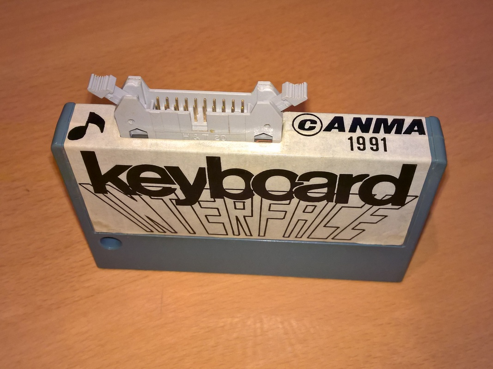
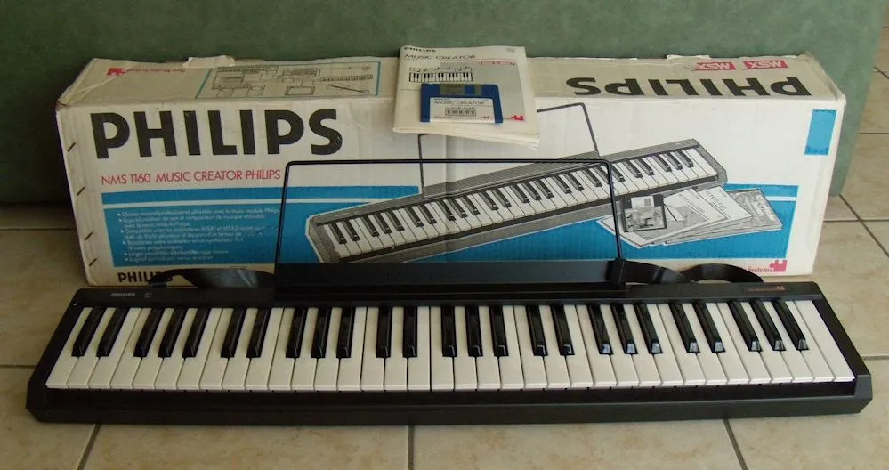

# Custom made interface for music tracker RED

This piece of custom build hardware was used to connect the Philips Music Keyboard NMS 1160 to ANMA's tracker RED.

See the images in this directory for more, like the designs.

In 2017 a remake was made by [roadfighter](https://msx.org/users/roadfighter) of which the PCB [can be seen here](https://www.msx.org/wiki/ANMA_Keyboard_Interface).

